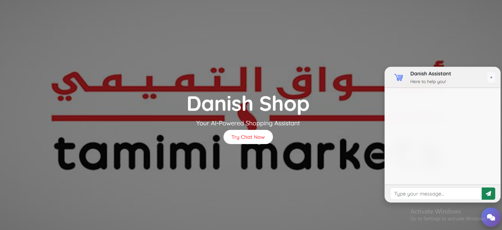

```markdown
# 🛒 Danish Shop – AI-Powered E-Commerce Assistant

**Danish Shop** is an intelligent e-commerce chatbot assistant powered by Google Gemini Pro and AstraDB Vector Store. It supports natural language queries about products and returns meaningful responses by retrieving relevant documents from a vector database.

This project demonstrates a clean modular architecture using **OOP principles**, **LangChain-style chaining**, **FastAPI**, and **Jinja2 frontend integration**.

---

## 📌 Features

- 💬 Natural language chat interface
- 🔎 Vector-based product retrieval (AstraDB)
- 🧠 Google Gemini Pro for LLM + embeddings
- 🧱 Modular OOP-based architecture
- 🌐 Clean UI using Bootstrap 5
- 🚀 Easily extensible for future marketplaces

---

## 🗂️ Folder Structure

```

├── config/
│   └── config.yaml          # Configuration settings
├── data/
│   ├── data\_ingestion/      # Ingestion pipelines
│   └── data\_scrapper/       # Raw data scrapers (optional)
├── prompt\_library/
│   └── prompt.py            # Prompt templates for LLM
├── retriever/
│   └── retrieval.py         # Embedding + vector search logic
├── static/                  # Images & frontend assets
├── templates/
│   └── chat.html            # Chat UI (Jinja2 + Bootstrap)
├── utils/
│   ├── config\_loader.py     # YAML config parser
│   └── model\_loader.py      # Gemini LLM & embed loader
├── .env                     # API Keys (Gemini, AstraDB, etc.)
├── main.py                  # FastAPI app entry point

````

---

## 🔧 Tech Stack

| Tech           | Purpose                         |
|----------------|----------------------------------|
| **FastAPI**    | Web backend & routing            |
| **Jinja2**     | Templating engine                |
| **Bootstrap 5**| Responsive UI                    |
| **Google Gemini Pro** | LLM + embedding generation     |
| **AstraDB**    | Vector store for product chunks  |
| **LangChain Core** | RunnableChains, Prompts         |

---

## 🚀 Setup Instructions

### 1. Clone the Repo
```bash
git clone https://github.com/yourusername/danish-shop-ai.git
cd danish-shop-ai
````

### 2. Create a Virtual Environment

```bash
python -m venv venv
source venv/bin/activate  # or venv\\Scripts\\activate
```

### 3. Install Requirements

```bash
pip install -r requirements.txt
```

### 4. Configure `.env` & `config.yaml`

* Create a `.env` file in root:

```env
ASTRA_DB_API_KEY=your_astra_db_key
ASTRA_DB_ID=your_db_id
GEMINI_API_KEY=your_gemini_key
```

* Update `config/config.yaml` with AstraDB and collection names.

---

## 🧠 How It Works

### 🔹 1. Data Ingestion (`data_ingestion/ingestion_pipeline.py`)

* Reads product data
* Generates Gemini embeddings
* Stores documents in AstraDB

### 🔹 2. Query Chain (`main.py`)

* Loads retriever from `retriever/retrieval.py`
* Passes question to Gemini via prompt in `prompt_library/`
* Returns formatted answer

### 🔹 3. Chat UI (`templates/chat.html`)

* Bootstrap interface with floating chatbot
* Sends AJAX request to `/get` endpoint

---

## ✨ Demo Preview


*(See full carousel by launching site)*

---

## 🧪 Example Prompt

```text
User: Tell me about Lenovo laptops for video editing.
```

```text
Bot: Based on customer reviews...

- **Lenovo Thinkpad E545:** Lightweight with a soft keyboard.
- **ThinkPad T440s:** Includes SD slot, 3 USB ports, and a crisp display.
```

---

## 🛠️ To Do / Improvements

* [ ] Add multilingual support (Arabic, Urdu)
* [ ] Deploy to Render/Vercel
* [ ] Admin panel for product upload
* [ ] Integrate with payment/checkout system

---

## 👤 Author

**Danish Shahzad**
📍 Pakistan → Saudi Arabia (remote available)
📧 [support@danishshop.com](mailto:danish.datascientist.com)
📹 [YouTube Demo](#) 

---

